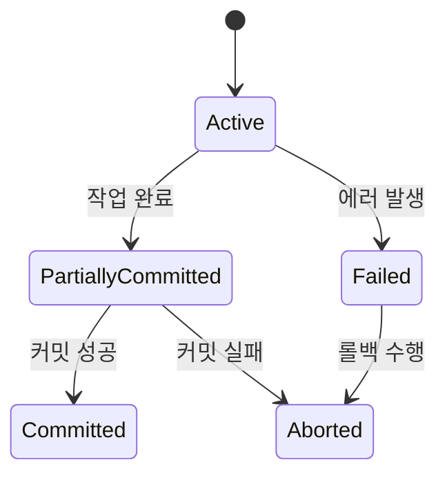
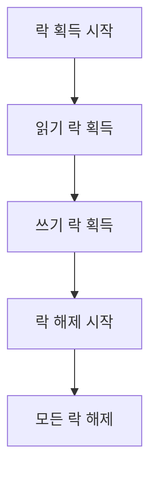
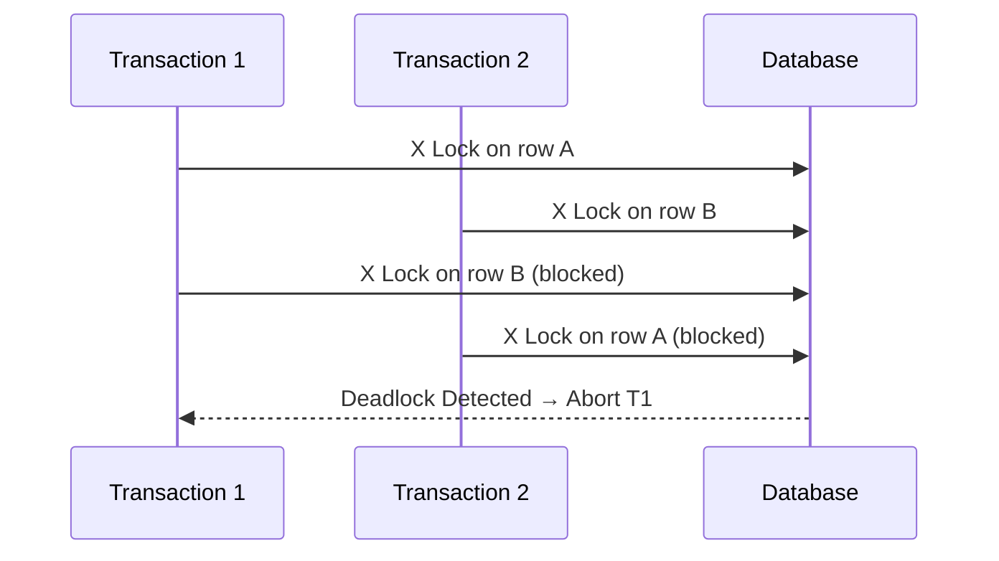

# Transaction & Concurrency

## ✅ 트랜잭션이란?

- 데이터베이스에서 **하나의 논리적인 작업 단위**
- 여러 쿼리를 하나의 트랜잭션으로 묶어 처리함
- 모두 성공하거나, 하나라도 실패 시 전체 작업을 롤백해야 함 (Atomicity)

## ✅ ACID 속성

1. **Atomicity (원자성)**
   - 트랜잭션 내 작업은 전부 수행되거나 전부 실패해야 함
2. **Consistency (일관성)**
   - 트랜잭션 실행 전후의 데이터는 항상 유효한 상태를 유지
3. **Isolation (격리성)**
   - 동시에 여러 트랜잭션이 실행될 때 서로 간섭하지 않아야 함
4. **Durability (지속성)**
   - 커밋된 트랜잭션의 결과는 장애가 발생해도 유지되어야 함

## ✅ 트랜잭션 상태

- **Active** → 작업 중
- **Partially Committed** → 커밋 전 중간 단계
- **Committed** → 성공적으로 반영됨
- **Failed / Aborted** → 실패하여 롤백됨

## ✅ 트랜잭션 격리 수준 (Isolation Level)

| 수준             | 설명                             | 허용되는 문제                                 |
| ---------------- | -------------------------------- | --------------------------------------------- |
| READ UNCOMMITTED | 커밋되지 않은 데이터 읽기 허용   | Dirty Read, Non-repeatable Read, Phantom Read |
| READ COMMITTED   | 커밋된 데이터만 읽음             | Non-repeatable Read, Phantom Read             |
| REPEATABLE READ  | 동일 쿼리는 항상 같은 결과       | Phantom Read                                  |
| SERIALIZABLE     | 가장 엄격, 완전한 순차 실행 보장 | 없음                                          |

## ✅ 트랜잭션 이상 현상

- **Dirty Read**: 다른 트랜잭션의 미완료 데이터를 읽음
- **Non-repeatable Read**: 동일 쿼리 결과가 다르게 나옴
- **Phantom Read**: 조건에 부합하는 행 수가 달라짐

## ✅ 동시성 제어 (Concurrency Control)

### Lock 기반 방식

- **Shared Lock (S)**: 읽기용, 여러 트랜잭션이 공유 가능
- **Exclusive Lock (X)**: 쓰기용, 단독 접근 필요

### 낙관적 락 vs 비관적 락

- **낙관적 락**: 충돌이 적다고 가정 → 커밋 전에 충돌 검증
- **비관적 락**: 충돌이 자주 발생한다고 가정 → 처음부터 락 사용

### 2단계 락킹(2PL, Two Phase Locking)

- **확장 단계**: 필요한 락들을 획득
- **축소 단계**: 모든 락을 해제
- 직렬 가능성을 보장하지만 교착 상태(deadlock) 위험 존재

### MVCC (Multi-Version Concurrency Control)

- 데이터를 수정할 때 스냅샷을 유지해 다른 트랜잭션에 영향을 최소화하는 기법
- PostgreSQL 및 MySQL InnoDB 등에서 기본으로 사용

## ✅ 기타 개념

- **Savepoint**: 트랜잭션 내에서 중간 지점을 설정하여 이후 롤백 가능
- **Autocommit**: 명시적 트랜잭션 없이 각 쿼리마다 자동 커밋 (기본 설정)
- **Deadlock**: 두 트랜잭션이 서로의 락 해제를 기다리며 무한 대기하는 상태

