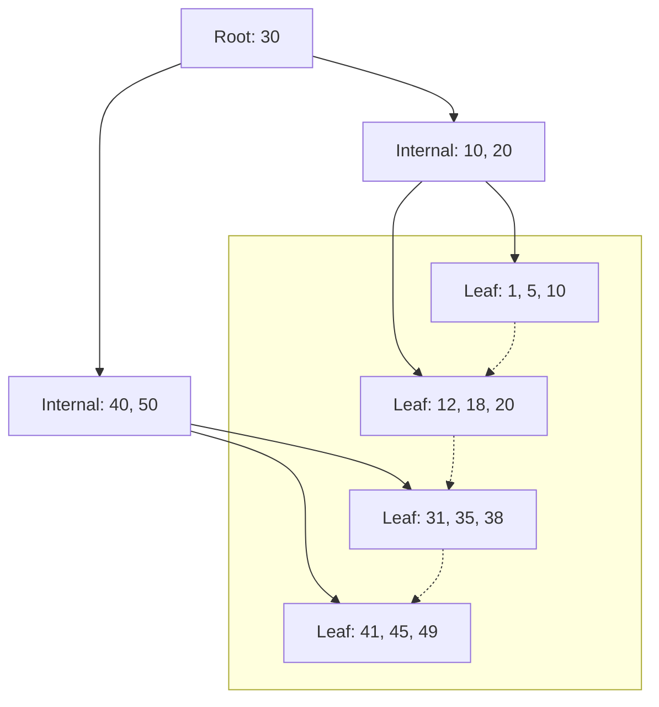

# Index

## ✅ 인덱스란?

- 인덱스(Index)는 데이터베이스 테이블에서 원하는 데이터를 빠르고 효율적으로 찾기 위해 사용하는 보조 자료구조입니다.
- 인덱스가 없으면 데이터베이스는 조건에 맞는 데이터를 찾기 위해 전체 테이블을 처음부터 끝까지 탐색(Full Table Scan)해야 하므로, 데이터가 많을수록 성능이 급격히 저하됩니다.
- 인덱스를 사용하면 조회(SELECT) 성능이 크게 향상되지만, 인덱스 유지/관리로 인해 INSERT, UPDATE, DELETE와 같은 쓰기 작업의 성능은 다소 저하될 수 있습니다.
- 인덱스는 책의 목차와 비슷하게, 원하는 정보를 빠르게 찾을 수 있도록 도와줍니다.

## ✅ 인덱스의 기본 구조

### B+ Tree 인덱스

- 대부분의 RDBMS(MySQL, PostgreSQL 등)에서 기본적으로 사용하는 인덱스 구조입니다.
- B+ Tree는 균형 잡힌 다진 탐색 트리로, 모든 리프 노드가 연결되어 있어 범위 검색(RANGE SCAN)에 매우 유리합니다.
- 내부 노드는 탐색 경로만 저장하고, 실제 데이터는 리프 노드에만 저장됩니다.
- 데이터가 추가/삭제되어도 트리의 균형이 자동으로 유지됩니다.



#### B+ Tree의 특징

- 검색, 삽입, 삭제 연산의 시간 복잡도는 O(log n)입니다.
- 리프 노드끼리 연결되어 있어 BETWEEN, >, < 등 범위 조건에 매우 효율적입니다.
- 인덱스의 크기가 커져도 트리의 높이가 낮게 유지되어 성능이 안정적입니다.

### Hash 인덱스

- 해시(Hash) 함수를 이용해 값을 저장하는 인덱스 구조입니다.
- 정확한 값 매칭(=)에 매우 빠르지만, 범위 검색(>, <, BETWEEN 등)에는 사용할 수 없습니다.
- MySQL의 InnoDB 엔진에서는 기본적으로 지원하지 않으며, MEMORY 엔진 등에서 사용됩니다.
- 충돌(Collision) 발생 시 성능 저하가 있을 수 있습니다.

### Inverted Index (역색인)

- 단어 → 문서 ID 목록을 저장하는 구조로, 주로 Full Text 검색이나 검색엔진(Elasticsearch, Lucene 등)에서 사용됩니다.
- 텍스트 데이터에서 특정 단어가 포함된 문서를 빠르게 찾을 수 있습니다.
- RDBMS의 일반 인덱스와는 구조와 목적이 다릅니다.

## ✅ 인덱스의 종류

### Primary Index (클러스터형 인덱스)

- 테이블의 기본 키(Primary Key)에 자동으로 생성되는 인덱스입니다.
- 실제 데이터가 인덱스 순서대로 저장되어 있습니다(InnoDB 기준).
- 한 테이블에 하나만 존재할 수 있습니다.

### Secondary Index (보조 인덱스)

- 기본 키가 아닌 컬럼에 생성하는 인덱스입니다.
- 인덱스에는 해당 컬럼 값과 함께 기본 키 값이 저장되어, 실제 데이터에 접근할 때 기본 키를 통해 찾아갑니다.
- 여러 개 생성할 수 있습니다.

### Unique Index (유니크 인덱스)

- 인덱스가 적용된 컬럼에 중복된 값이 저장되지 않도록 보장합니다.
- Primary Key와 유사하지만, NULL 값을 허용할 수 있습니다.

### Composite Index (복합 인덱스)

- 두 개 이상의 컬럼을 조합하여 생성한 인덱스입니다.
- WHERE, ORDER BY, GROUP BY 등에서 여러 컬럼이 함께 사용될 때 성능을 높일 수 있습니다.
- 컬럼 순서에 따라 인덱스 사용 여부가 달라지므로 설계 시 주의가 필요합니다.

## ✅ 인덱스를 사용하지 못하는 경우

- WHERE 절에서 컬럼에 연산이나 함수가 적용된 경우  
  (예: `WHERE age + 1 = 30`, `WHERE DATE(created_at) = '2024-01-01'`)
- 컬럼 앞에 와일드카드가 있는 LIKE 검색  
  (예: `LIKE '%abc'`)
- 인덱스가 적용된 컬럼의 값이 너무 중복이 많을 때(선택도가 낮을 때)
- 데이터 타입이 불일치하는 경우(숫자 컬럼에 문자열 비교 등)
- OR 조건이 여러 컬럼에 걸쳐 있을 때(특정 상황)

## ✅ 커버링 인덱스 (Covering Index)

- 쿼리에서 필요한 모든 컬럼이 인덱스에 포함되어 있어, 테이블의 실제 데이터(레코드)에 접근하지 않고도 결과를 반환할 수 있는 인덱스입니다.
- MySQL에서는 EXPLAIN 결과의 Extra 컬럼에 `Using index`로 표시됩니다.
- 디스크 I/O를 줄여 성능을 크게 향상시킬 수 있습니다.

**예시**

```sql
CREATE INDEX idx_user_email ON user (email, name);
SELECT email, name FROM user WHERE email = 'test@example.com';
```

- 위 쿼리는 email, name 컬럼만 조회하므로 커버링 인덱스가 적용됩니다.

## ✅ 실행 계획 분석

- 인덱스가 실제로 사용되는지, 어떤 방식으로 데이터에 접근하는지 확인하려면 `EXPLAIN`, `EXPLAIN ANALYZE` 명령을 사용합니다.
- 주요 확인 항목:
  - `type`: 접근 방식 (ALL, index, range, ref, eq_ref 등)
  - `key`: 사용된 인덱스 이름
  - `rows`: 예측되는 읽기 행 수
  - `ref`: 조인 시 참조되는 컬럼
  - `extra`: 추가 정보 (Using index, Using where 등)

**예시**

```sql
EXPLAIN SELECT * FROM user WHERE email = 'test@example.com';
```

## ✅ 인덱스 튜닝 전략

- 자주 조회되는 컬럼, WHERE / JOIN / ORDER BY / GROUP BY에 자주 등장하는 컬럼에 인덱스를 적용합니다.
- 불필요한 인덱스는 제거해야 합니다. 인덱스가 많을수록 쓰기 성능이 저하되고, 저장 공간도 낭비됩니다.
- 단일 인덱스보다는 복합 인덱스를 고려하되, 컬럼 순서가 중요합니다(선두 컬럼 기준).
- 데이터의 분포(선택도)를 고려하여 인덱스를 설계합니다.
- 인덱스 재구성(REBUILD) 및 통계 정보 갱신을 주기적으로 수행합니다.
- PostgreSQL 등 일부 DBMS는 부분 인덱스(Partial Index)나 함수 기반 인덱스를 지원해 특정 조건에서 효율적

## ✅ 실무에서의 주의사항

- 인덱스는 무조건 많다고 좋은 것이 아닙니다. 쿼리 패턴을 분석한 뒤 필요한 인덱스만 적용해야 합니다.
- 데이터가 자주 변경(INSERT/UPDATE/DELETE)되는 컬럼에는 인덱스 적용을 신중히 결정해야 합니다.
- 대용량 데이터에서는 인덱스 생성/삭제 작업이 오래 걸릴 수 있으므로, 운영 환경에서는 주의가 필요합니다.
- 인덱스가 잘못 설계되면 오히려 성능이 저하될 수 있으므로, 실행 계획(EXPLAIN) 분석을 통해 효과를 검증해야 합니다.
- 데이터베이스마다 인덱스 동작 방식이 다를 수 있으니, 사용하는 DBMS의 공식 문서를 참고하는 것이 좋습니다.
