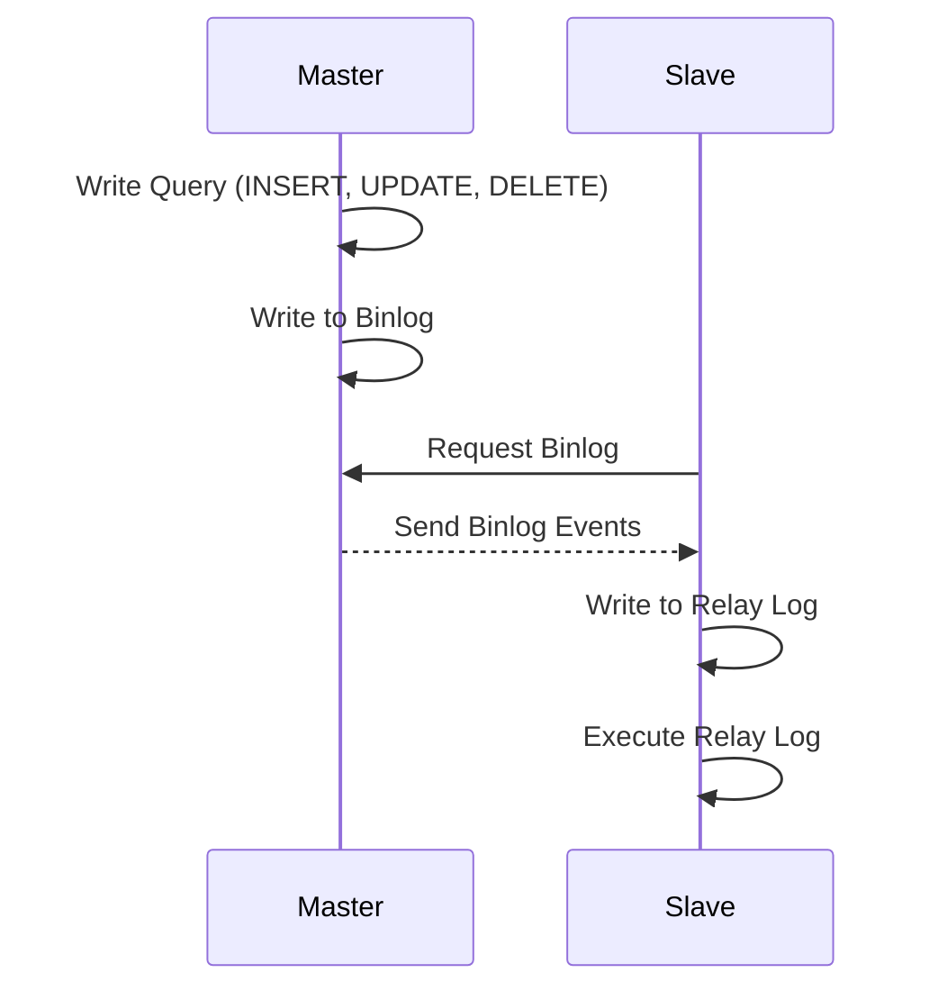

# Replication & Backup

- 데이터베이스 복제(Replication)를 사용하면 읽기 부하 분산과 장애 대응 가능
- 백업 방식: 풀 백업(Full), 증분 백업(Incremental), 차등 백업(Differential)
- 핫 백업 vs 콜드 백업: 서비스 중단 여부에 따라 구분
- 장애 상황을 가정한 복구 시뮬레이션(Disaster Recovery)이 실무에서 매우 중요

## ✅ Replication이란?

Replication은 하나의 데이터베이스 서버의 데이터를 다른 서버로 복제하는 기술입니다. 데이터 고가용성(HA) 확보, 부하 분산, 장애 복구 등의 목적에서 사용되며, 구성 방식에 따라 다양한 확장과 최적화를 구현할 수 있습니다.

### 복제 유형

- **Master-Slave**

  - Master 서버에서 쓰기(INSERT, UPDATE, DELETE 등), Slave 서버에서 읽기(SELECT 등) 처리
  - 대용량 Read 처리 시 부하 분산 효과
  - Master에 비해 Slave 반영이 지연(Lag)될 수 있음 → 실시간 일관성 보장 어려움

- **Master-Master**

  - 양방향 쓰기 가능하며, 두 곳 이상에서 동시에 데이터 변경 가능
  - 충돌 처리(Conflict Resolution) 전략이 필요 (특정 컬럼 우선권, 타임스탬프 비교 등)

- **Semi-Synchronous / Asynchronous**
  - **비동기(Asynchronous)**: Master가 먼저 커밋하고, Slave는 이후에 변경 사항을 반영
    - Master 커밋 지연이 없으므로 쓰기 성능에 유리
    - Slave 반영이 늦을 수 있어 실시간 동기화가 필요한 경우 주의
  - **준동기(Semi-Synchronous)**: 최소 한 대의 Slave가 변경 내용을 받았음을 확인해야만 Master가 최종 커밋 완료
    - 완전 동기보다는 성능 저하를 줄이면서 데이터 보존성을 어느 정도 확보

### Replication 동작 원리 (MySQL 기준)

1. **Binlog 작성 (Master)**
   - Master는 데이터 변경 시 binlog(Binary Log)에 기록
2. **Relay Log 수신 (Slave)**
   - Slave의 I/O 스레드가 Master에서 binlog를 가져와서 로컬 relay log에 저장
3. **Relay Log 실행 (Slave)**
   - Slave의 SQL 스레드가 relay log를 순차적으로 실행하여 Slave DB를 Master와 동기화

#### 주의 사항

- **Binlog 유실**: Master가 binlog를 생성하지 못하거나 네트워크 장애 시 동기화 누락 위험
- **Slave 지연**: Slave가 트래픽 급증 시 처리 속도가 늦어져 실시간 동기화가 어려울 수 있음
- **Failover 시나리오**: Master 장애 시 Slave를 즉시 승격(Promote)할 수 있도록 Auto-Failover 도구(Orchestrator 등)를 고려

## ✅ Backup이란?

Backup은 장애나 오류 발생 시 데이터 손실을 최소화하고, 빠른 복구를 위해 미리 확보해 두는 데이터 복사본입니다. 운영 환경에서는 백업 주기, 보관 매체, 복원 테스트 절차를 종합적으로 고려하여 신중하게 설계해야 합니다.

### 백업 유형

- **Logical Backup**

  - SQL 문 형태로 데이터를 덤프 (예: `mysqldump`)
  - 특정 테이블이나 스키마 등 부분 백업 가능
  - 복원 시 SQL 문을 재실행하므로 대용량 환경에서는 시간이 오래 걸릴 수 있음

- **Physical Backup**

  - 실제 데이터 파일 자체를 복사 (예: Percona XtraBackup)
  - 대용량 환경에서 빠른 백업/복원 가능
  - 특정 테이블만 부분 복원하기는 어려울 수 있음

- **Full / Incremental / Differential**
  - **Full**: 전체 데이터를 백업
  - **Incremental**: 마지막 백업 이후 변경된 데이터만 백업 → 백업 크기 및 시간 절약
  - **Differential**: 최초 Full 이후 변경분을 반복 백업 (Incremental과 유사하지만, 매번 Full 이후 시점 기준)

### 백업 전략 예시

- **주간(Weekly) Full Backup + 일간(Daily) Incremental Backup**
  - 주말 등 부하가 적은 시점에 전체 백업
  - 평일에는 간단한 증분 백업으로 빠른 백업 수행
- **백업 파일 보관**
  - 원격지 또는 클라우드에 안전하게 복사(지리적으로 떨어진 곳)
  - 장기 보관이 필요한 데이터는 별도 정책으로 관리
- **복원 테스트(Recovery Test)**
  - 정기적으로 실제 복원 과정을 시험하여 성공 여부 및 예상 복원 시간을 확인
  - 장애 시점(RPO, RTO)에 맞춘 복구 시나리오 점검

## ✅ 실무 포인트

- **Replication**: 주요 목적(HA, 부하 분산 등)에 맞춰 Master/Slave 수, 동기화 방식 비동기/준동기 등을 선정
- **Backup**: 백업 주기, 보관 정책, 복구 전략까지 종합적으로 고려해야 하며, 실제 장애 상황을 가정한 복구 테스트가 중요
- **Failover 및 Disaster Recovery**: 자동 혹은 수동 Failover를 위한 절차(슬레이브 승격 등)를 마련하고, 별도의 재해 복구(Disaster Recovery) 사이트 구성을 고려
- **보안 요소**: 백업 파일 암호화, 전송 시점의 네트워크 암호화, 접근 권한 관리 등 보안 정책을 적용
- **성능 영향**: 백업 및 복구, 그리고 리플리케이션 자체가 시스템 성능에 영향을 줄 수 있으므로, 트래픽이 적은 시간대를 활용하거나, 전용 서버를 두는 방안을 검토
