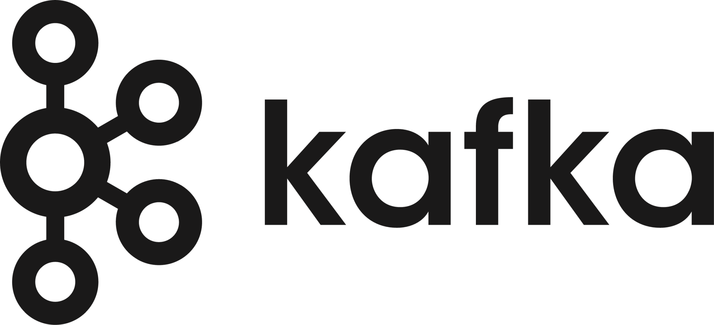

# Kafka Overview

## ✅ Kafka란?

Kafka는 LinkedIn에서 개발한 분산 메시징 시스템으로, 대용량의 실시간 데이터를 처리하기 위해 만들어졌다. 현재는 Apache Software Foundation의 오픈소스 프로젝트로 운영되고 있으며, 높은 처리량과 내구성, 확장성을 제공하는 것이 특징이다.

Kafka는 내부적으로 Publish/Subscribe 모델을 기반으로 동작하며, 메시지를 주고받는 시스템을 느슨하게 결합할 수 있게 해준다. 로그 수집, 실시간 분석, 이벤트 기반 시스템, MSA 간 비동기 통신 등에 널리 활용된다.

## ✅ 주요 특징

- **고성능 처리**: 초당 수백만 건의 메시지를 처리할 수 있는 고속 처리 능력
- **내구성**: 디스크 기반 저장과 복제(replication)를 통해 메시지를 안정적으로 보관
- **확장성**: 파티션 단위 수평 확장을 지원하여 처리량 증가에 유연하게 대응 가능
- **분산 시스템**: 브로커, 파티션, 컨슈머 그룹 등으로 구성된 완전한 분산 구조

## ✅ 구성 요소

- **Producer**: 메시지를 Kafka에 전송하는 클라이언트 애플리케이션
- **Consumer**: 메시지를 읽어가는 클라이언트 애플리케이션
- **Topic**: 메시지를 카테고리별로 나누어 저장하는 논리적 공간
- **Partition**: 하나의 Topic을 여러 개로 나눈 단위로, 병렬 처리를 가능하게 함
- **Broker**: Kafka 서버 프로세스로, 메시지를 저장하고 처리함
- **Zookeeper**: 클러스터 메타데이터, 컨트롤러 선출 등을 담당 (2.x까지 필요)
- **Controller**: 클러스터 내에서 리더 파티션을 관리하고 메타데이터 업데이트를 수행

## ✅ 메시지 저장 구조

Kafka는 각 Topic을 여러 Partition으로 나누고, Partition은 브로커에 분산되어 저장된다. 메시지는 순서대로 Append-only 방식으로 저장되며, 각 메시지는 고유한 Offset을 가진다. Consumer는 이 Offset을 기준으로 메시지를 읽어간다.

## ✅ Kafka가 해결하는 문제

- **전통적인 메시징 시스템의 병목**: 높은 처리량과 병렬 처리를 통한 확장
- **복잡한 서비스 간 통신 구조**: 느슨하게 연결된 이벤트 기반 아키텍처 제공
- **로그 수집, 데이터 파이프라인의 비효율**: 중앙 집중형 스트리밍 플랫폼으로서 실시간 ETL 구조 구성 가능

## ✅ 활용 사례

- 사용자 행동 로그 수집 및 분석
- 실시간 알림 시스템
- MSA 간 이벤트 브로커
- 실시간 데이터 파이프라인 구축 (Kafka → Spark/Flink → DB/S3 등)
- CDC(Change Data Capture) 시스템 기반 구성
