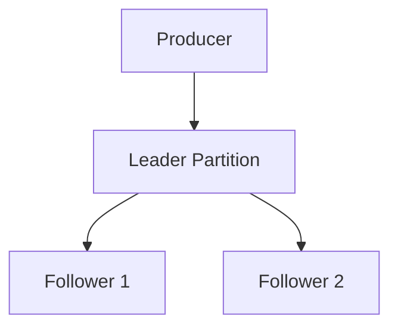

# Operations & Reliability

## ✅ Replication 구조

Kafka는 데이터의 안정성과 내구성을 확보하기 위해 Replication을 지원한다.
하나의 Partition은 여러 Broker에 복제되며, 리더와 팔로워로 역할이 구분된다.

- **Leader**: 모든 읽기/쓰기 작업은 리더 파티션에서 처리된다.
- **Follower**: 리더의 데이터를 복제만 수행하며, 클라이언트와 직접 통신하지 않음
- **ISR(In-Sync Replicas)**: 리더와 데이터가 동기화된 팔로워 목록

## ✅ Retention 설정

Kafka는 메시지를 일정 기간 또는 용량 기준으로 보관하고 삭제할 수 있도록 설정할 수 있다.

- `retention.ms`: 메시지를 유지할 시간 (기본값 7일)
- `retention.bytes`: 파티션당 최대 저장 용량
- `delete` vs `compact` 정책
  - delete: 시간이 지나면 삭제
  - compact: 최신 값만 유지, 과거 키는 제거

## ✅ 주요 설정 항목

- `num.partitions`: 기본 Partition 수 설정
- `replication.factor`: 복제본 개수 (보통 2 또는 3)
- `segment.ms`, `segment.bytes`: 로그 세그먼트 분할 기준
- `min.insync.replicas`: 최소 ISR 수 (acks=all 조건에 영향)
- `unclean.leader.election.enable`: 비동기 팔로워를 리더로 승격할 수 있는지 여부

## ✅ 장애 대응 전략

### 브로커 장애

- 리더 브로커 장애 시, ISR 내 팔로워가 새로운 리더로 자동 선출
- 컨트롤러가 재선출되고, 메타데이터 업데이트 수행

### 컨슈머 장애

- 다른 컨슈머가 같은 Group 내에서 할당된 파티션을 인계받아 처리

### ISR 축소

- 네트워크 지연, 브로커 과부하 등으로 ISR 수 감소 가능
- `min.insync.replicas` 미만 시 쓰기 실패 발생 가능

## ✅ 모니터링 포인트

Kafka 운영 시 다음 지표들을 주기적으로 모니터링해야 한다:

- **Consumer Lag**: 메시지 소비 지연 여부
- **Broker 상태**: CPU, 메모리, 디스크 I/O
- **Under Replicated Partitions**: 리더에 동기화되지 않은 파티션 수
- **Request Latency**: 처리 지연 시간
- **Throughput**: 초당 메시지 수, 바이트 수

보통 Prometheus + Grafana 또는 Confluent Control Center를 통해 시각화하여 운영된다.
