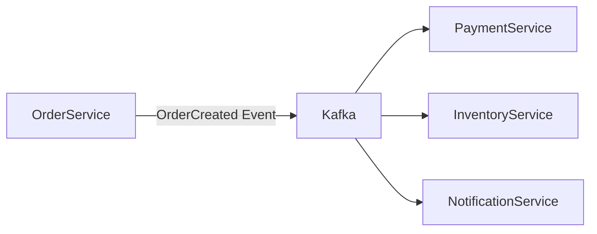

# Use Cases

## ✅ MSA 아키텍처에서 이벤트 브로커로 사용

Kafka는 마이크로서비스 간의 비동기 이벤트 전달을 위한 메시지 브로커로 널리 사용된다. 서비스 간 결합도를 낮추고, 이벤트 기반 구조를 통해 확장성과 유연성을 확보할 수 있다.

- 주문 서비스 → 결제 서비스 → 배송 서비스 등 비동기 흐름 구성
- 하나의 이벤트를 여러 Consumer가 구독하여 다양한 후처리 가능

## ✅ 실시간 로그 수집 및 분석

Kafka는 수많은 서버나 애플리케이션에서 발생하는 로그를 중앙에서 수집하는 데 최적화되어 있다.
수집된 로그는 Elasticsearch, Hadoop, S3 등에 저장하거나, 실시간 분석 파이프라인에 연결할 수 있다.

- Beats/Fluentd → Kafka → Logstash/Spark → Elasticsearch
- Kafka를 통해 수집 지점과 분석 지점을 분리

## ✅ 실시간 알림 시스템

Kafka의 낮은 지연 시간과 높은 처리량을 활용해 실시간 알림 시스템을 구축할 수 있다.

- 사용자 활동 → Kafka → Websocket 알림 → 클라이언트 전송
- Slack, 이메일, SMS 등 다양한 채널에 분기 가능

## ✅ 데이터 파이프라인 구성

Kafka는 실시간 또는 준실시간 데이터 파이프라인을 구성할 수 있는 중심축 역할을 한다.

- CDC(Change Data Capture) 시스템

  - DB → Kafka Connect → Kafka Topic
  - Topic → Sink Connector → Elasticsearch, S3 등

- Kafka Streams/Flink 등과 연계하여 실시간 처리 및 변환 수행

## ✅ Kafka Streams / Kafka Connect

- Kafka Streams

  - Kafka 내부에서 실행되는 분산 스트림 처리 라이브러리
  - 상태 기반 집계, 윈도우 처리, 조인 등 복잡한 스트림 처리 지원

- Kafka Connect
  - 외부 시스템과 Kafka 간 데이터 연동을 위한 플러그인 기반 프레임워크
  - Source/Sink Connector를 통해 DB, 파일, 클라우드 스토리지 등과 연결

## ✅ 장점 요약

- **비동기 이벤트 흐름** 구성 가능
- **처리량과 확장성**이 뛰어나 고부하 시스템에도 적합
- **다양한 연동 도구** 및 커뮤니티 생태계 확보
