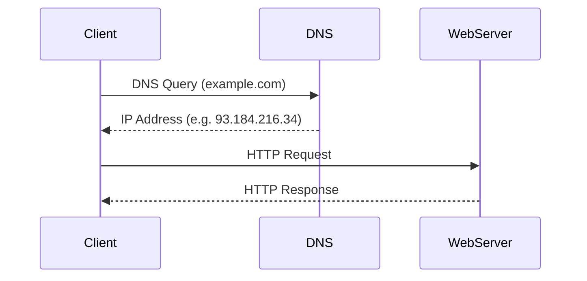

# Network Overview

## ✅ 네트워크란?

컴퓨터 네트워크는 서로 다른 장치 간에 데이터를 전송하고 공유할 수 있도록 연결하는 시스템입니다. 이를 위해 다양한 계층(OSI 모델, TCP/IP 모델), 프로토콜, 장비들이 협력하여 통신을 가능하게 합니다.

네트워크는 크게 **LAN, WAN, 인터넷**으로 구분되며, **클라이언트-서버 모델**, **P2P 모델**, **웹 통신 구조**, **DNS, DHCP, NAT, TLS** 등 다양한 구성 요소로 이루어져 있습니다.

## ✅ 네트워크의 주요 목적

- 데이터 통신 및 공유
- 자원의 효율적 사용
- 분산 시스템 구현
- 실시간 서비스 지원 (웹, 메시징, 스트리밍 등)

## ✅ 네트워크 유형

- **LAN (Local Area Network)**: 소규모 사설망 (예: 사무실, 집)
- **WAN (Wide Area Network)**: 지리적으로 넓은 범위의 연결망 (예: 인터넷)
- **PAN, MAN** 등도 존재 (개인망, 도시망)

## ✅ 네트워크 구성 요소

- **호스트 (Host)**: 데이터를 송수신하는 장치 (PC, 서버, 스마트폰 등)
- **라우터 (Router)**: 네트워크 간 경로 설정 및 패킷 전달
- **스위치 (Switch)**: LAN 내부에서 프레임 전송
- **허브 (Hub)**: 단순 브로드캐스트 장비 (과거 사용)
- **방화벽 (Firewall)**: 트래픽 필터링 및 보안 정책 적용

## ✅ 네트워크 계층 모델

### OSI 7 계층

1. 물리 계층 (Physical)
2. 데이터 링크 계층 (Data Link)
3. 네트워크 계층 (Network)
4. 전송 계층 (Transport)
5. 세션 계층 (Session)
6. 표현 계층 (Presentation)
7. 응용 계층 (Application)

### TCP/IP 4 계층

1. 링크 계층 (Link)
2. 인터넷 계층 (Internet)
3. 전송 계층 (Transport)
4. 응용 계층 (Application)

## ✅ 프로토콜(Protocol)

- **IP (Internet Protocol)**: 논리 주소 기반 라우팅
- **TCP/UDP**: 연결형 vs 비연결형 전송
- **HTTP/HTTPS**: 웹 통신 프로토콜
- **DNS**: 도메인 → IP 매핑
- **DHCP**: 네트워크 설정 자동화
- **ARP**: IP ↔ MAC 주소 매핑
- **TLS/SSL**: 보안 통신 암호화

## ✅ 네트워크 흐름 예시

1. 클라이언트는 DNS를 통해 IP 주소 조회
2. 조회된 서버 IP로 HTTP 요청 전송
3. 응답을 받아 웹페이지 렌더링

## ✅ 실무 관점에서 고려 사항

- 속도: RTT, 대역폭, MTU
- 신뢰성: 패킷 손실, 재전송, 흐름 제어
- 보안: 암호화, 인증, 방화벽
- 확장성: NAT, 로드 밸런싱, CDN
- 유지보수: 로그 분석, 모니터링, 트래픽 제어
