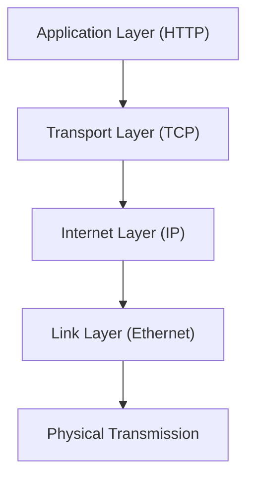

# TCP/IP 모델

## ✅ TCP/IP 모델이란?

TCP/IP(Transmission Control Protocol / Internet Protocol) 모델은 인터넷 통신의 기반이 되는 네트워크 구조로, 4개의 계층으로 구성됩니다. OSI 7계층보다 간결하며 실제 네트워크 시스템에서 더 많이 사용됩니다.

- 응용 계층 (Application Layer)
- 전송 계층 (Transport Layer)
- 인터넷 계층 (Internet Layer)
- 네트워크 접근 계층 (Link Layer)

## ✅ TCP/IP 계층별 설명

### 1. 응용 계층 (Application Layer)

- 사용자에게 서비스를 제공하는 계층
- HTTP, HTTPS, DNS, FTP, SMTP 등 응용 프로토콜 포함

### 2. 전송 계층 (Transport Layer)

- 송수신 간 신뢰성 있는 데이터 전달
- TCP: 연결형, 신뢰성 보장
- UDP: 비연결형, 빠른 전송, 신뢰성 없음

### 3. 인터넷 계층 (Internet Layer)

- 패킷 전송을 위한 논리적 주소(IP)를 기반으로 라우팅
- IP, ICMP, ARP, IGMP 프로토콜 포함

### 4. 네트워크 접근 계층 (Link Layer)

- 실제 네트워크와의 물리적 연결
- 데이터 링크 및 물리 계층 기능 수행 (Ethernet, MAC, Wi-Fi 등)

## ✅ TCP/IP 통신 흐름

- 각 계층은 하위 계층에 데이터를 넘겨 캡슐화(Encapsulation) 진행
- 수신 측에서는 역순으로 역캡슐화(Decapsulation) 수행

## ✅ TCP/IP vs OSI 모델 비교

| TCP/IP 계층        | OSI 계층                     | 주요 프로토콜 예시   |
| ------------------ | ---------------------------- | -------------------- |
| 응용 계층          | 응용, 표현, 세션 계층        | HTTP, DNS, FTP, SMTP |
| 전송 계층          | 전송 계층                    | TCP, UDP             |
| 인터넷 계층        | 네트워크 계층                | IP, ICMP, ARP        |
| 네트워크 접근 계층 | 데이터 링크 계층 + 물리 계층 | Ethernet, Wi-Fi, MAC |

## ✅ 실무에서의 이해 포인트

- TCP와 UDP의 쓰임새 구분이 중요 (속도 vs 신뢰성)
- 캡슐화/역캡슐화의 과정 이해
- 각 계층의 역할이 애플리케이션 개발 시 어떤 영향을 미치는지 인식
