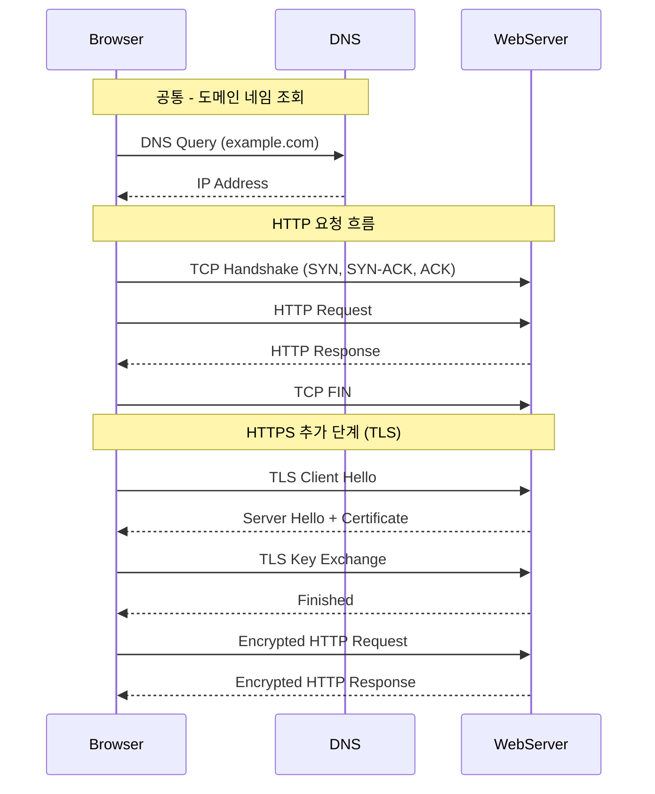

# HTTP

## ✅ HTTP란?

HTTP(HyperText Transfer Protocol)는 **클라이언트**(브라우저)와 **서버** 간에 **웹 리소스**(HTML, 이미지 등)를 주고받기 위한 **비연결성, 무상태(stateless)** 프로토콜입니다.

## ✅ HTTP 특징

- 텍스트 기반 프로토콜 (읽기 쉬움)
- Stateless (요청 간 상태를 유지하지 않음)
- Connectionless (요청/응답 후 연결 종료)
- 요청-응답 구조 (Request/Response)

## ✅ HTTP 메시지 구조

### 📤 요청(Request)

- 요청라인: `GET /index.html HTTP/1.1`
- 헤더: 요청 정보 (Host, User-Agent 등)
- 바디: POST 등에서 데이터 포함

### 📥 응답(Response)

- 상태라인: `HTTP/1.1 200 OK`
- 헤더: 서버 정보, 콘텐츠 타입 등
- 바디: 실제 HTML, 이미지 등 데이터

## ✅ 주요 HTTP 메서드

| 메서드  | 설명                        |
| ------- | --------------------------- |
| GET     | 리소스 조회                 |
| POST    | 리소스 생성/제출            |
| PUT     | 리소스 전체 수정            |
| PATCH   | 리소스 부분 수정            |
| DELETE  | 리소스 삭제                 |
| HEAD    | 헤더만 조회                 |
| OPTIONS | 서버가 지원하는 메서드 확인 |

## ✅ 상태 코드

| 코드 범위 | 의미            | 예시                                    |
| --------- | --------------- | --------------------------------------- |
| 1xx       | 정보            | 100 Continue                            |
| 2xx       | 성공            | 200 OK, 201 Created                     |
| 3xx       | 리다이렉션      | 301 Moved Permanently, 304 Not Modified |
| 4xx       | 클라이언트 오류 | 400 Bad Request, 404 Not Found          |
| 5xx       | 서버 오류       | 500 Internal Server Error               |

## ✅ HTTP/1.1 vs HTTP/2 vs HTTP/3

| 항목      | HTTP/1.1                  | HTTP/2           | HTTP/3 (QUIC)             |
| --------- | ------------------------- | ---------------- | ------------------------- |
| 연결 방식 | TCP                       | TCP + 멀티플렉싱 | UDP 기반 QUIC 프로토콜    |
| 전송 방식 | 순차 처리 (HOL 문제 있음) | 병렬 처리 가능   | 병렬 처리 + 빠른 재전송   |
| 헤더 압축 | 없음                      | HPACK            | QPACK                     |
| 성능      | 느림                      | 개선됨           | 모바일 환경에서 더욱 빠름 |
| TLS 통합  | 별도                      | 별도             | 기본 내장 (TLS 1.3 기반)  |

## ✅ HTTP와 HTTPS 차이점

- HTTPS는 HTTP 위에 **TLS/SSL**을 추가한 **암호화된 통신 방식**
- HTTPS = HTTP + 인증 + 암호화 + 무결성

## ✅ 실무 팁

- 캐시: Cache-Control, ETag, 304 응답 적극 활용
- Keep-Alive 설정으로 연결 재사용 가능
- CORS 정책 이해 필수 (웹 브라우저 보안)
- HTTPS는 TLS 인증서 필요, Let's Encrypt 활용 가능
