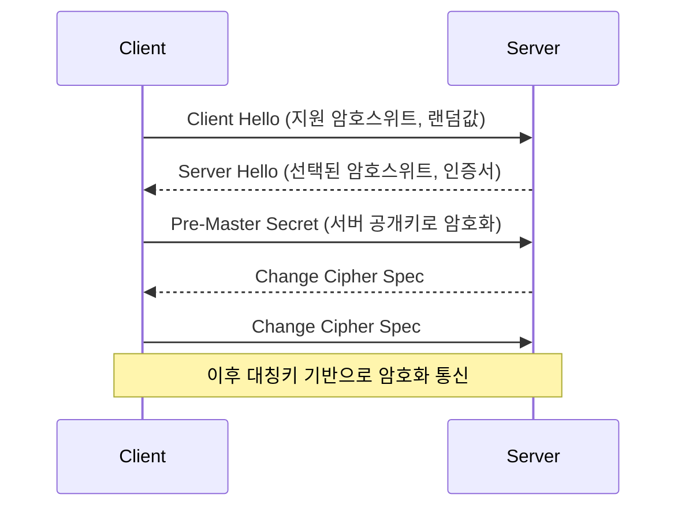

# TLS

## ✅ TLS란?

TLS(Transport Layer Security)는 인터넷에서 안전한 통신을 보장하기 위한 **암호화 프로토콜**입니다.

HTTPS는 HTTP 위에 TLS 계층을 추가하여 구현된 것으로, TLS는 데이터의 **기밀성, 무결성, 인증**을 제공합니다.

## ✅ TLS의 주요 기능

- **암호화 (Encryption)**: 중간에서 내용을 볼 수 없도록 함 (대칭키 기반)
- **무결성 (Integrity)**: 데이터가 위/변조되지 않았음을 보장 (MAC)
- **인증 (Authentication)**: 서버/클라이언트 신원 확인 (인증서 기반)

## ✅ TLS 핸드셰이크 과정 (TLS 1.2 기준)

## ✅ TLS 1.3 핸드셰이크 변화

- 1-RTT: 연결 속도 개선 (왕복 지연 1회로 단축)
- 불필요한 암호스위트 제거, 보안 강화
- 서버 인증서는 ClientHello 이후 바로 전송됨

## ✅ TLS 인증서란?

- 서버의 신원을 확인하기 위한 **공개키 인증서 (X.509)**
- **CA**(Certificate Authority)가 서명한 신뢰 가능한 문서
- 도메인 이름, 공개키, 만료일 등이 포함됨
- 클라이언트는 루트 CA 목록을 기반으로 유효성 검증

## ✅ TLS 통신 과정 요약

1. 클라이언트가 서버에 접속 시도 (ClientHello)
2. 서버가 인증서와 설정을 전송 (ServerHello)
3. 키 교환 및 대칭키 생성
4. 양측에서 ChangeCipherSpec 후 암호화 통신 시작

## ✅ TLS 실무 팁

- HTTPS는 TLS를 사용하지만, TLS 자체는 HTTP에 종속되지 않음 (SMTP, IMAP 등도 사용)
- TLS 버전은 서버 설정에서 제어 가능 (TLS 1.3 권장)
- Let's Encrypt 등을 통한 무료 인증서 사용 가능
- 클라이언트와 서버의 **암호화 스펙 호환성**이 중요함
