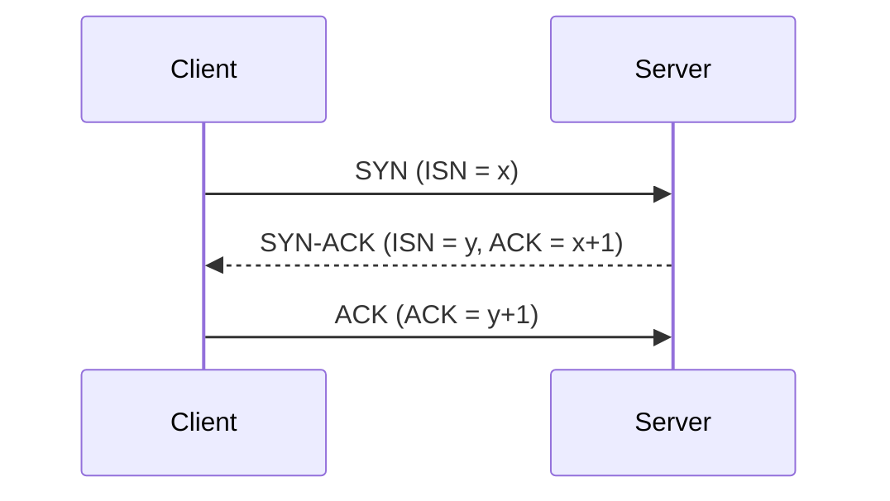
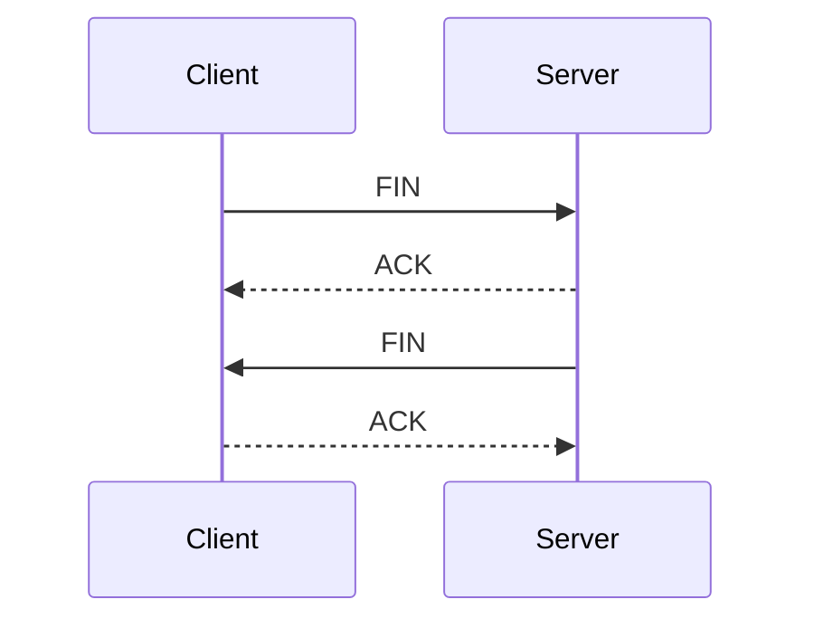
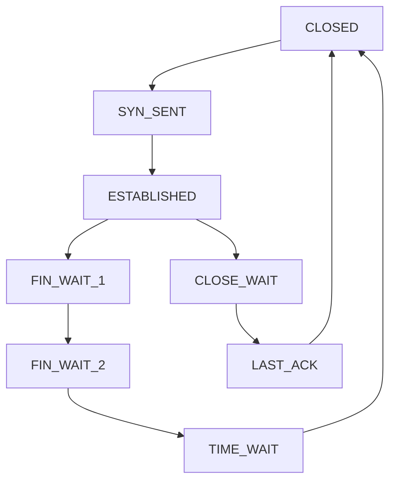

# Transport Layer (TCP vs UDP)

## ✅ 전송 계층이란?

전송 계층은 OSI 7계층의 4번째 계층으로, **종단 간(end-to-end)** 통신을 담당합니다. 응용 계층에서 받은 데이터를 패킷 단위로 나누고, 신뢰성 있는 데이터 전송을 위한 **오류 제어**, **흐름 제어**, **혼잡 제어**, **순서 보장** 등을 제공합니다.

## ✅ TCP (Transmission Control Protocol)

- 연결 지향 (Connection-Oriented)
- 신뢰성 보장: 손실, 순서, 중복 처리
- 흐름 제어와 혼잡 제어 포함
- 패킷 단위: 세그먼트(segment)

### TCP 3-Way Handshake (연결 설정)

### TCP 4-Way Handshake (연결 종료)

### 왜 연결은 3번, 종료는 4번일까?

- 연결은 **양측이 모두 데이터를 송수신할 준비가 되었는지 확인하는 동기화 과정**이기 때문에 3번의 패킷 교환이 필요합니다.
- 반면, 연결 종료는 **송신과 수신이 독립적으로 닫혀야 하므로** 각 방향의 종료 요청을 명확히 하기 위해 4번의 교환이 이루어집니다.

### 흐름 제어 (Flow Control)

- 수신자의 처리 능력에 따라 송신자가 데이터 전송량 조절
- 윈도우 크기 기반 제어 (Sliding Window)

### 혼잡 제어 (Congestion Control)

- 네트워크의 혼잡 상태를 감지하고 전송 속도 조절
- 대표적인 알고리즘: Slow Start, Congestion Avoidance, Fast Retransmit

## ✅ UDP (User Datagram Protocol)

- 비연결형 (Connectionless)
- 신뢰성 없음 (순서 보장 X, 재전송 X)
- 빠르고 단순한 구조
- 패킷 단위: 데이터그램(datagram)
- 헤더 크기: 8바이트로 매우 작음

### 사용 예시

- 실시간 스트리밍 (YouTube, Zoom)
- DNS, DHCP 등 빠른 질의/응답
- 온라인 게임, VoIP 등 낮은 지연이 중요한 서비스

### 실무 고려 사항

- 포트 충돌 시 자체 복구 불가 → 애플리케이션에서 보완 필요
- 데이터 유실 가능성 → ACK/재전송 논리를 별도로 구현해야 함
- NAT 환경에서는 **UDP hole punching** 기법으로 양방향 연결 확보 필요

## ✅ TCP vs UDP 비교

| 항목           | TCP                      | UDP                           |
| -------------- | ------------------------ | ----------------------------- |
| 연결 방식      | 연결형 (3-way handshake) | 비연결형                      |
| 신뢰성         | 보장 (재전송, 순서 유지) | 없음 (순서 보장 X, 유실 가능) |
| 속도           | 느림 (오버헤드 있음)     | 빠름 (단순한 구조)            |
| 오버헤드       | 큼 (20바이트 이상)       | 작음 (8바이트)                |
| 흐름/혼잡 제어 | 있음                     | 없음                          |
| 사용 예시      | 웹, 메일, 파일 전송      | 스트리밍, DNS, VoIP           |

## ✅ TCP 상태 다이어그램

- **SYN_SENT**: 연결 요청 전송 후 대기 상태
- **ESTABLISHED**: 양측 연결 완료
- **FIN_WAIT / CLOSE_WAIT**: 종료 요청 수신 및 처리 중
- **TIME_WAIT**: 지연 패킷 대응을 위한 대기 상태

## ✅ 면접 포인트

- TCP와 UDP의 차이를 구조, 예제 중심으로 설명할 수 있어야 함
- 3-Way / 4-Way Handshake 흐름과 이유를 말할 수 있어야 함
- TCP 상태 다이어그램을 기억하고 응용할 수 있어야 함
- UDP 기반 서비스의 유실 가능성과 그 보완 방식에 대한 이해
