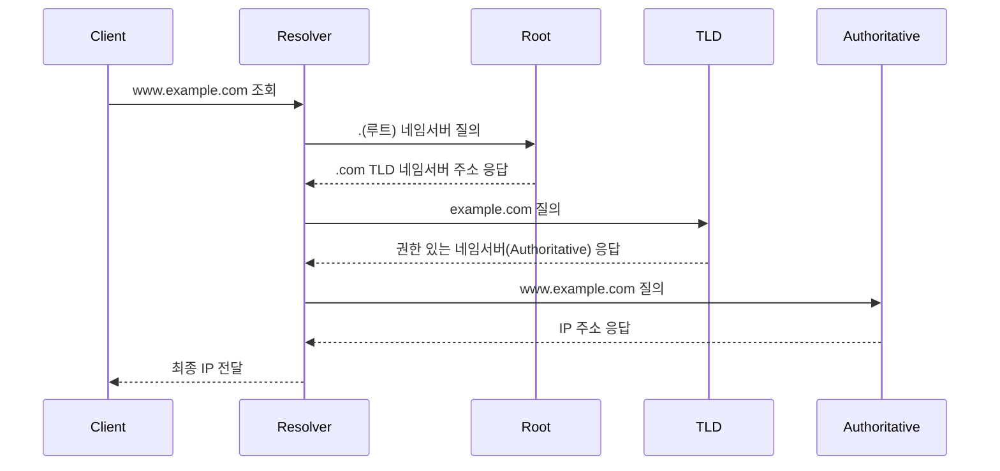

# DNS

## ✅ DNS란?

DNS(Domain Name System)는 사람이 이해하기 쉬운 **도메인 이름**(example.com)을 컴퓨터가 이해할 수 있는 **IP 주소**로 변환해주는 시스템입니다.

인터넷의 전화번호부 역할을 하며, 웹 브라우저가 도메인을 입력했을 때 실제 서버에 접근할 수 있도록 해줍니다.

## ✅ DNS의 필요성

- 사용자는 IP 주소 대신 도메인 이름으로 접근
- IP 주소가 바뀌어도 도메인을 유지하면 서비스 지속 가능

## ✅ 도메인 구조

- 예시: `www.example.com`
  - `com`: 최상위 도메인 (TLD)
  - `example`: 2차 도메인
  - `www`: 호스트 이름 (서브도메인)

## ✅ DNS 레코드 종류

| 레코드 타입 | 설명                           | 예시                           |
| ----------- | ------------------------------ | ------------------------------ |
| A           | 도메인 → IPv4 주소 매핑        | example.com → 93.184.216.34    |
| AAAA        | 도메인 → IPv6 주소 매핑        | example.com → ::1              |
| CNAME       | 별칭 도메인 → 실제 도메인 매핑 | www → example.com              |
| MX          | 메일 서버 주소                 | example.com → mail.example.com |
| TXT         | 인증 정보, SPF 등 기록         | 도메인 소유권 증명 등          |

## ✅ DNS 질의 과정

## ✅ 캐싱 동작

- **브라우저 캐시**: 이전 방문 도메인 정보 유지
- **운영체제 캐시**: 시스템 단 DNS 캐시
- **로컬 DNS 서버 캐시**: ISP 또는 회사 DNS에서 반복 요청 대응
- TTL(Time To Live)에 따라 캐시 유효 시간 결정

## ✅ 실무 팁

- `dig`, `nslookup` 명령어로 DNS 조회 확인 가능
- TTL 설정은 변경 가능, 너무 짧으면 트래픽 증가
- 도메인 이전 시 NS 레코드 반영 시간 고려 필요
- Cloudflare, Route53 등을 이용한 DNS 보안/최적화 가능
