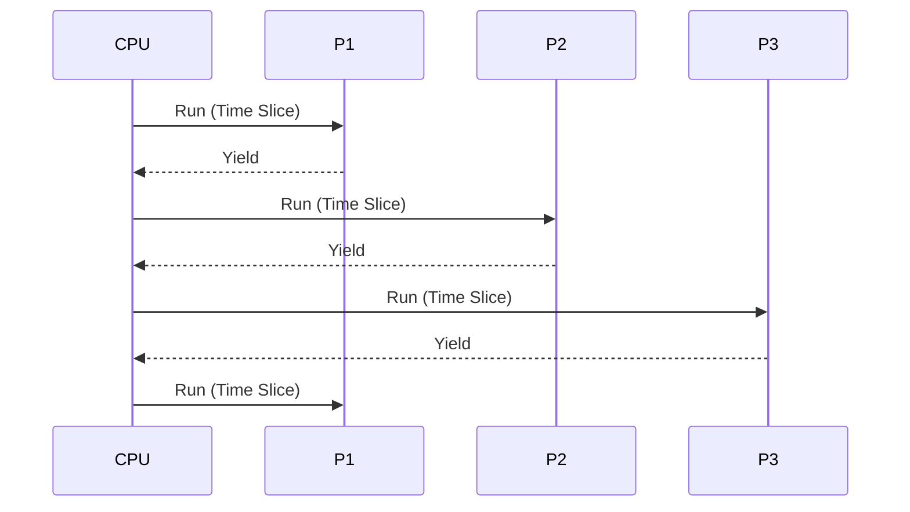

# CPU Scheduling

## ✅ 스케줄링의 필요성

- CPU는 한 번에 하나의 프로세스만 실행 가능
- 다수의 프로세스가 동시에 준비 상태일 경우, 어떤 프로세스에 CPU를 할당할지 결정하는 정책 필요

## ✅ 스케줄러의 종류

- **장기 스케줄러 (Long-term)**: 메모리에 적재할 프로세스 선택 (입출력 중심 vs CPU 중심)
- **단기 스케줄러 (Short-term)**: CPU를 할당할 준비 완료 프로세스를 결정
- **중기 스케줄러 (Medium-term)**: 프로세스를 일시 중단/복귀시켜 메모리 사용 최적화

## ✅ 스케줄링 시점

- 프로세스 종료
- 프로세스가 대기 상태로 전환
- 인터럽트 발생
- 타이머 만료 (선점형의 경우)

## ✅ 선점형 vs 비선점형

| 구분          | 선점형                            | 비선점형                              |
| ------------- | --------------------------------- | ------------------------------------- |
| 개념          | 실행 중인 프로세스 강제 중단 가능 | 자발적으로 CPU를 반환할 때까지 기다림 |
| 예시 알고리즘 | Round Robin, SRTF                 | FCFS, SJF (Non-preemptive)            |

## ✅ 스케줄링 알고리즘 종류

### FCFS (First Come First Serve)

- 먼저 도착한 프로세스부터 실행
- 비선점형
- Convoy 현상 발생 가능 (짧은 작업이 긴 작업을 기다림)

### SJF (Shortest Job First)

- 실행 시간이 가장 짧은 프로세스 우선 실행
- 평균 대기 시간 최소화
- 비선점형/선점형 모두 가능
- 실행 시간 예측이 필요함

### Priority Scheduling

- 우선순위가 높은 프로세스를 먼저 실행
- 낮은 우선순위의 프로세스가 무한 대기할 수 있음 (Starvation)
- Aging 기법으로 해결 가능

### Round Robin

- 타임 슬라이스(Time Quantum) 단위로 CPU 순환 할당
- 선점형
- 인터랙티브 시스템에 적합

### Multilevel Queue

- 우선순위 그룹별로 별도 큐 운영 (예: 시스템/대화식/배치 등)
- 각 큐마다 독립된 알고리즘 사용 가능

### Multilevel Feedback Queue

- 프로세스가 동적으로 큐를 이동
- 초기에는 높은 우선순위 큐에 배치되며, 실행 시간이 길어질수록 낮은 큐로 이동

## ✅ 성능 평가 지표

- **CPU Utilization**: CPU가 바쁘게 동작한 시간 비율
- **Throughput**: 단위 시간당 완료된 프로세스 수
- **Turnaround Time**: 프로세스 시작부터 종료까지 걸린 시간
- **Waiting Time**: 대기 큐에서 기다린 시간
- **Response Time**: 요청 후 첫 응답까지 걸린 시간

## ✅ 실무 팁

- 서버 응답 성능이 중요한 환경에서는 선점형 스케줄링(Round Robin, Priority) 선호
- 배치성 작업이 많다면 SJF 기반 스케줄링 고려
- 리눅스 커널은 CFS (Completely Fair Scheduler)를 기본 사용
