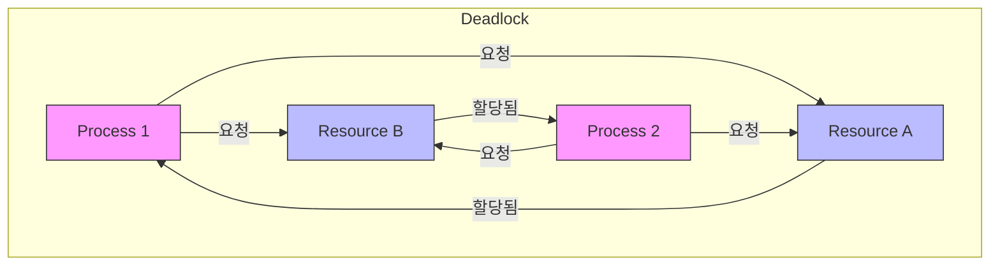

# Synchronization

## ✅ 임계 구역(Critical Section)

둘 이상의 프로세스(또는 스레드)가 동시에 접근해서는 안 되는 공유 자원을 접근하는 코드 영역

- 잘못된 접근 시 데이터 정합성 문제 발생
- 상호 배제(Mutual Exclusion)가 필요함

## ✅ 동기화 조건

1. 상호 배제 (Mutual Exclusion)
2. 진행 (Progress)
3. 유한 대기 (Bounded Waiting)
4. 비선점 (Preemption)

## ✅ 소프트웨어적 해결 방법

### Peterson's Algorithm (2개 프로세스 전용)

- 두 개의 프로세스 간에 상호 배제를 보장
- busy-waiting 기반

## ✅ 하드웨어적 해결 방법

- Test-and-Set, Swap, Compare-and-Swap 등의 원자적 명령어 사용
- 사용자 수준에서 구현 가능하지만, busy-waiting 문제 존재

## ✅ 세마포어(Semaphore)

- 공유 자원 접근을 제한하기 위한 정수형 동기화 도구
- P(S), V(S) 연산 사용

```c
P(S): while (S <= 0) wait; S--;
V(S): S++;
```

### 종류

- Binary Semaphore (0 또는 1, 뮤텍스와 유사)
- Counting Semaphore (자원 개수 제한)

## ✅ 뮤텍스(Mutex)

- 상호 배제를 위한 Lock 객체
- 소유한 스레드만 해제 가능 → 소유권 개념 존재
- 단일 자원 보호에 적합함

## ✅ 모니터(Monitor)

- Lock과 Condition Variable을 함께 제공하는 고수준 동기화 도구
- Java의 `synchronized`, Python의 `with` 등

## ✅ 데드락(Deadlock)

둘 이상의 프로세스가 자원을 점유한 상태에서 서로 상대방의 자원을 요청하며 무한히 대기하는 상태

### 발생 조건 (4가지 모두 충족 시 데드락 발생)

1. **상호 배제 (Mutual Exclusion)**
   - 자원은 한 번에 하나의 프로세스만 사용할 수 있음
2. **점유 대기 (Hold and Wait)**
   - 최소 하나의 자원을 점유한 상태에서 다른 자원을 요청하며 대기함
3. **비선점 (No Preemption)**
   - 다른 프로세스가 점유 중인 자원을 강제로 빼앗을 수 없음
4. **순환 대기 (Circular Wait)**
   - 각 프로세스가 다음 프로세스가 가진 자원을 기다리는 순환 형태가 존재함



## ✅ 데드락 해결 전략

- **예방 (Prevention)**: 4가지 조건 중 하나 이상을 제거하여 원천 차단

  - ex) 순환 대기 방지를 위해 자원 할당 순서 고정

- **회피 (Avoidance)**: 시스템 상태가 안전한 경우에만 자원 할당 (Banker's Algorithm)

- **탐지 후 복구 (Detection & Recovery)**: 데드락 상태를 감지한 후 프로세스를 종료하거나 자원 회수

## ✅ 실무 팁

- 동시성 문제가 있는 경우 로그 타임스탬프 분석이 중요
- 락을 사용하면 반드시 해제 코드도 존재해야 함 (try-finally 패턴)
- Java: `ReentrantLock`, `synchronized`, `wait/notify`, `CountDownLatch`, `Semaphore`
- Go: `sync.Mutex`, `sync.WaitGroup`, `channel` 기반 구조
