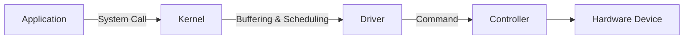

# File System & I/O

## ✅ 파일 시스템의 역할

- 데이터의 저장 및 관리
- 디렉터리 구조 제공
- 접근 제어 및 권한 관리
- 파일 이름 → 실제 저장 위치 매핑

## ✅ 파일의 구성

- 이름 (Name)
- 식별자 (Identifier): 내부적으로 파일을 식별하는 번호
- 유형 (Type): 텍스트, 바이너리 등
- 위치 (Location): 디스크 상의 위치
- 크기 (Size): 파일 길이
- 권한 (Permission): 읽기, 쓰기, 실행 여부

## ✅ 디렉터리 구조

- 단일 레벨 디렉터리
- 2단계 디렉터리
- 트리 구조 (계층적 구조)
- DAG 구조 (공유 파일 허용)

## ✅ 파일 할당 방식

### 1. 연속 할당 (Contiguous Allocation)

- 장점: 빠른 접근 속도, 간단한 구현
- 단점: 외부 단편화 발생, 파일 크기 사전 예측 필요

### 2. 연결 할당 (Linked Allocation)

- 장점: 외부 단편화 없음
- 단점: 접근 속도 느림, 임의 접근 불가

### 3. 인덱스 할당 (Indexed Allocation)

- 장점: 임의 접근 가능, 외부 단편화 없음
- 단점: 인덱스 블록 공간 필요

## ✅ 입출력(I/O) 시스템 구조

1. 응용 프로그램
2. 시스템 콜 (read, write 등)
3. 운영체제 I/O 서브시스템
4. 디바이스 드라이버
5. 하드웨어 컨트롤러

## ✅ I/O 방식 종류

### 1. Programmed I/O

- CPU가 직접 입출력 제어
- 입출력 동안 CPU가 대기 (Busy Waiting)

### 2. Interrupt-driven I/O

- 디바이스가 준비되면 인터럽트를 통해 CPU에 알림
- CPU는 다른 작업 가능 (효율적)

### 3. DMA (Direct Memory Access)

- CPU를 거치지 않고 디바이스와 메모리 간 직접 데이터 전송
- 빠른 I/O 가능, CPU 부하 감소

## ✅ 블로킹 I/O vs 논블로킹 I/O

- **블로킹 I/O**: 호출한 함수가 I/O 완료될 때까지 대기
- **논블로킹 I/O**: 즉시 반환되며, 이후 상태를 polling 또는 event로 확인

## ✅ 캐시와 버퍼

- **버퍼(Buffer)**: 입출력 속도 차이를 조정하는 메모리 공간
- **캐시(Cache)**: 자주 접근되는 데이터를 임시 저장하여 접근 속도 향상

## ✅ 실무 관점 고려사항

- 파일 I/O 성능은 디스크 종류(SSD/HDD), 파일 시스템 형식(ext4/xfs 등)에 영향 받음
- I/O 병목은 대부분 디스크 IOPS 한계 또는 동기화 문제에서 발생
- 고성능 I/O를 위해 비동기 처리, 배치 쓰기, 메모리 매핑 기법 사용 가능
