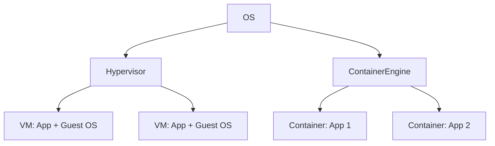

# Virtualization

## ✅ 가상화란?

가상화(Virtualization)는 하나의 물리적 시스템 자원을 논리적으로 분리하여 다수의 독립된 환경처럼 사용할 수 있게 해주는 기술입니다. 이를 통해 서버 통합, 자원 효율화, 이식성 증가, 테스트 환경 분리, 보안 격리 등을 실현할 수 있습니다.

운영체제에서는 크게 **시스템 가상화**(하이퍼바이저 기반)와 **컨테이너 가상화**(OS 레벨)로 나뉘며, 각각 목적과 기술 스택, 격리 수준이 다릅니다.

## ✅ 가상화의 목적

- 자원의 활용률 극대화 (CPU, 메모리 등)
- 환경 격리를 통한 보안성 확보
- 빠른 배포 및 이식성 향상
- 테스트 및 개발 환경 분리

## ✅ 시스템 가상화 (Hypervisor 기반)

### 하이퍼바이저(Hypervisor)

하드웨어에서 직접 가상 머신을 관리하는 소프트웨어

- **Type 1 (Bare-metal)**

  - 하드웨어 위에서 직접 실행됨 (ex. VMware ESXi, Microsoft Hyper-V, KVM)
  - 성능과 안정성 우수

- **Type 2 (Hosted)**
  - 기존 OS 위에서 실행 (ex. VMware Workstation, VirtualBox)
  - 개발용 및 데스크탑 환경에 적합

### 가상 머신(VM)의 특징

- 전체 OS와 커널 포함 → 무겁고 느림
- 완벽한 하드웨어 추상화 가능
- 격리성 우수, OS 혼합 가능

## ✅ 컨테이너 가상화 (OS 레벨 가상화)

### 개념

- 커널은 공유하되 사용자 공간만 분리
- 격리된 프로세스 집합 (namespace + cgroups)

### 주요 기술

- Docker, containerd, LXC 등

### 특징

- 빠른 시작/종료, 적은 오버헤드
- 이미지 기반 배포 → CI/CD와 궁합 좋음
- 같은 OS 커널만 사용 가능 (혼합 불가)

## ✅ VM vs Container 비교

| 항목          | 가상 머신(VM) | 컨테이너(Container)     |
| ------------- | ------------- | ----------------------- |
| 커널          | 별도 OS 포함  | 호스트 OS 공유          |
| 시작 속도     | 수 초         | 수 밀리초               |
| 오버헤드      | 큼            | 작음                    |
| 격리 수준     | 매우 강함     | 적당히 강함             |
| 운영체제 혼합 | 가능          | 불가능 (동일 커널 필요) |

## ✅ 실무에서의 고려사항

- 보안성이 중요한 경우 VM 활용
- 빠른 배포/테스트/경량화 필요 시 컨테이너 적합
- VM 위에 컨테이너 실행하는 하이브리드 구조도 가능
- Kubernetes 등 오케스트레이션 시스템과 연계 필수
