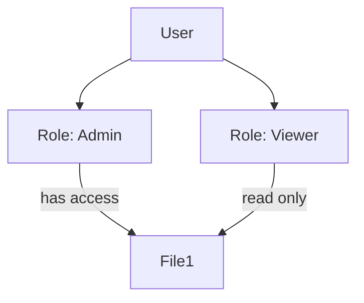

# Security & Protection

## ✅ Summary

운영체제에서의 보안(Security)과 보호(Protection)는 시스템 자원(파일, 메모리, CPU 등)을 무단 접근이나 오용으로부터 방어하는 역할을 수행합니다.

- **보안(Security)**: 외부로부터의 침입, 악성 행위로부터 시스템을 보호 (외부 공격자 중심)
- **보호(Protection)**: 내부 사용자 및 프로세스 간의 자원 접근을 제어 (내부 사용자 중심)

운영체제는 계정 기반 인증, 권한 제어, 메모리 보호, 접근 제어 행렬 등 다양한 기법으로 이를 구현합니다.

## ✅ 위협 유형

- **악성 코드(Malware)**: 바이러스, 웜, 트로이 목마 등
- **DoS/DDoS**: 자원 고갈을 통한 서비스 마비
- **권한 상승**: 낮은 권한 사용자가 관리자 권한 탈취
- **스푸핑/피싱**: 신원을 속여 권한 획득

## ✅ 사용자 인증

- ID/Password 기반 로그인
- 다단계 인증 (2FA)
- 생체 인식, 보안 토큰, OTP 등

## ✅ 접근 제어 방식

### 1. DAC (Discretionary Access Control)

- 리소스 소유자가 권한 관리 (ex. UNIX의 chmod)

### 2. MAC (Mandatory Access Control)

- 중앙 정책에 따라 권한 설정 (군사 시스템 등 보안 등급 기반)

### 3. RBAC (Role-Based Access Control)

- 역할에 따라 권한 부여 (ex. 관리자/사용자/게스트)

## ✅ 메모리 보호 기법

- **주소 공간 분리**: 사용자 모드와 커널 모드 구분
- **Base/Limit 레지스터**: 접근 가능한 메모리 범위 제한
- **세그먼트, 페이지 보호**: 읽기/쓰기/실행 권한 제어

## ✅ 파일/디스크 보호

- 권한 비트 (rwx)
- 접근 제어 리스트(ACL)
- 암호화 저장 (AES, LUKS 등)

## ✅ 시스템 보호 기법

- **Trap, Interrupt** 기반 예외 처리
- **Timer**를 이용한 무한 루프 방지
- **시스템 콜 필터링** (seccomp 등)
- **샌드박스(Sandbox)**: 제한된 실행 환경 제공

## ✅ 보안 강화 기술

- SELinux, AppArmor: 정책 기반 접근 제어
- ASLR (Address Space Layout Randomization): 메모리 랜덤 배치
- Stack Canary: 스택 버퍼 오버플로우 방지
- Executable Space Protection (NX bit)

## ✅ 실무 팁

- 최소 권한 원칙 적용 (Least Privilege)
- 시스템 호출/파일 접근 로그 감시
- 컨테이너 격리 강화 (Seccomp, AppArmor, rootless)
- 인증서 기반 통신 (TLS, SSH)
