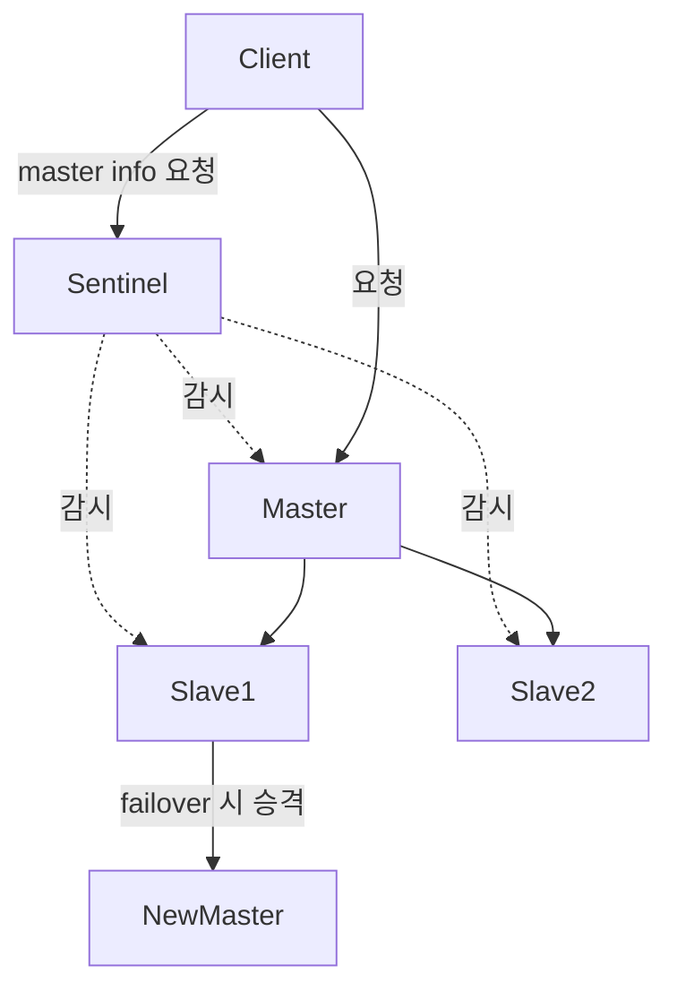

# Sentinel & Cluster

## ✅ Redis의 고가용성(HA) 구성 필요성

Redis는 기본적으로 단일 인스턴스로 작동하지만, 실서비스에서는 **장애 대응 및 확장성**을 위해 고가용성 구성이 필요합니다.
Redis는 이를 위해 **Sentinel**과 **Cluster** 두 가지 방식을 제공합니다.

## ✅ Redis Sentinel

Redis Sentinel은 **Master-Slave 구조에서 자동 장애 감지 및 Failover**를 수행하는 고가용성 도구입니다.

### 주요 기능

- 마스터 장애 감지 (자동 ping)
- 새로운 마스터 선출 및 슬레이브 재구성
- 클라이언트에게 새 마스터 정보를 알려줌

```bash
# sentinel.conf 예시
sentinel monitor mymaster 127.0.0.1 6379 2
sentinel down-after-milliseconds mymaster 5000
sentinel failover-timeout mymaster 10000
```

### 구조도



> [!WARNING]
> Sentinel은 **데이터 분산은 하지 않으며**, 마스터가 단일 노드임

## ✅ Redis Cluster

Redis Cluster는 **데이터를 자동으로 분산**(샤딩)하고, **복제 및 장애 조치까지 제공하는 분산형 Redis**입니다.

### 주요 특징

- 노드 간 데이터 분산 (Hash Slot 기반)
- 마스터/슬레이브 구조 내장
- 일부 노드 장애 시에도 서비스 유지 가능

### 구성 요소

| 역할          | 설명                               |
| ------------- | ---------------------------------- |
| 마스터 노드   | 데이터를 저장하고 요청 처리        |
| 슬레이브 노드 | 마스터의 복제본, 장애 시 승격 대상 |

```bash
# 클러스터 노드 시작 시 redis.conf 설정 필요
cluster-enabled yes
cluster-config-file nodes.conf
cluster-node-timeout 5000
```

### 데이터 분산 방식

- 전체 16384개의 해시 슬롯을 마스터 노드들이 나눠서 소유
- 클라이언트는 키 → 해시 슬롯 → 노드로 라우팅됨

> [!NOTE] > `{user:1}`처럼 키의 해시 범위를 명시해 같은 슬롯으로 고정 가능

## ✅ Sentinel vs Cluster 비교

| 항목            | Sentinel                              | Cluster                        |
| --------------- | ------------------------------------- | ------------------------------ |
| 데이터 분산     | ❌ 단일 마스터                        | ✅ 자동 분산 (해시 슬롯)       |
| 복제            | ✅ Master-Slave                       | ✅ Master-Slave                |
| 장애 조치       | ✅ 가능 (Sentinel이 선출 및 전환)     | ✅ 가능 (슬레이브 자동 승격)   |
| 확장성          | ❌ 제한적                             | ✅ 수평 확장 가능              |
| 클라이언트 지원 | Redis 연결 정보 필요 (동적 변경 필요) | 클러스터-aware 클라이언트 필요 |

> [!NOTE]
> Sentinel은 단순한 고가용성 구성에 적합하고, Cluster는 고가용성과 **수평 확장(Scaling)** 모두 필요한 환경에 적합

## ✅ 실무 적용 기준

| 상황                                  | 추천 방식              |
| ------------------------------------- | ---------------------- |
| 단일 마스터 구조에서 장애 대응 필요   | Sentinel               |
| 데이터 양이 많고 수평 확장 필요       | Cluster                |
| 트래픽이 집중되는 특정 키가 있는 경우 | Cluster + 키 해시 튜닝 |
