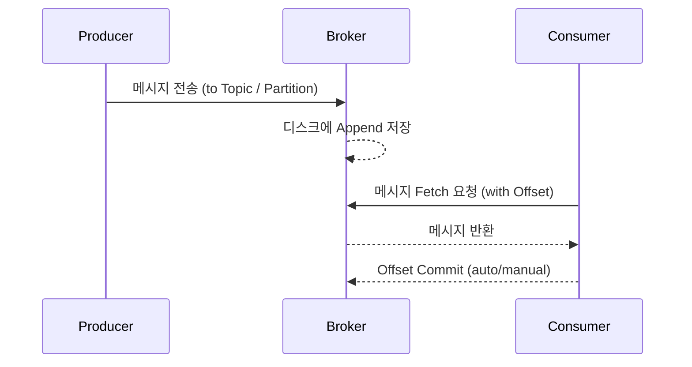

# Message Flow & Delivery Guarantees

## ✅ 메시지 흐름 요약

1. Producer가 특정 Topic에 메시지를 전송한다.
2. 메시지는 Topic의 Partition에 저장된다.
3. 메시지는 브로커의 디스크(Log Segment)에 순차적으로 저장된다.
4. Consumer는 오프셋을 기준으로 메시지를 읽는다.
5. 읽은 오프셋은 Consumer Group 기준으로 commit된다.

## ✅ 메시지 저장 방식

Kafka는 Append-Only 로그 구조를 기반으로 메시지를 디스크에 순차적으로 기록한다.
각 메시지는 고유한 Offset을 가지며, Partition별로 순서를 보장한다.

- **Segment**: Partition은 여러 개의 세그먼트 파일로 구성된다.
- **Index**: 오프셋 → 파일 위치를 매핑하는 인덱스 구조가 존재한다.
- **Retention**: 일정 시간 또는 용량 기준으로 로그 파일을 삭제할 수 있다.

## ✅ Consumer 동작 방식

- Consumer는 자신이 속한 Consumer Group 기준으로 Partition을 할당받는다.
- 메시지를 읽은 뒤, 해당 Offset을 커밋한다.
- 커밋은 자동/수동 방식 중 선택 가능하며, 주로 Kafka 내부의 `__consumer_offsets` 토픽에 저장된다.

### 커밋 전략

- **Auto Commit**: `enable.auto.commit=true`
- **Manual Commit**: 필요 시점에 커밋, 정확한 제어 가능

## ✅ 메시지 전달 보장 수준 (Delivery Semantics)

Kafka는 기본적으로 다음 3가지 메시지 전달 방식을 제공한다:

### At most once (최대 1회)

- 메시지는 중복 없이 전달되지만 유실 가능성이 존재함
- Consumer가 처리 전에 종료되면 데이터 손실 발생

### At least once (최소 1회)

- 메시지는 유실되지 않지만 중복 수신 가능
- 일반적인 Kafka 기본 설정에서 사용됨

### Exactly once (정확히 1회)

- 메시지는 유실 없이, 중복 없이 정확히 1회 처리됨
- Producer/Consumer 모두 설정 필요 + Transaction API 활용 필요
- Kafka Streams 또는 Idempotent Producer 구성 시 사용

## ✅ Idempotent Producer

- Kafka 0.11부터 도입
- 중복 메시지 전송을 방지하기 위한 기능
- `enable.idempotence=true` 설정 시 활성화됨
- 브로커는 Producer ID + Sequence Number로 중복 여부를 판별함

## ✅ Transactional Messaging

- Kafka 0.11부터 지원
- 여러 Partition에 메시지를 보내거나, 메시지를 읽고 다시 쓸 때 단일 트랜잭션으로 처리 가능
- Producer는 `transactional.id` 설정 필요
- 메시지는 "commit"되기 전까지 Consumer에게 보이지 않음

## ✅ Consumer Rebalancing

- Consumer Group의 멤버 수가 바뀌거나 Partition 수가 바뀔 때 재할당이 발생
- 이 과정을 Rebalancing이라고 하며, 이 시점 동안에는 데이터 소비가 일시 중단됨
- 최신 Kafka는 Cooperative Rebalancing으로 중단 시간을 최소화함
